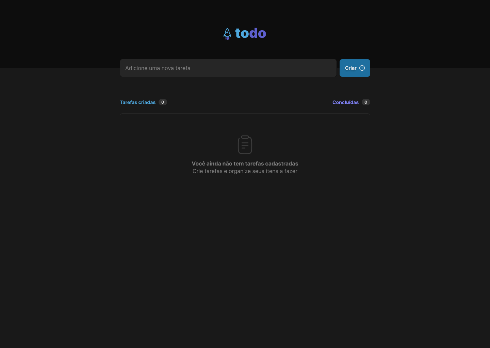
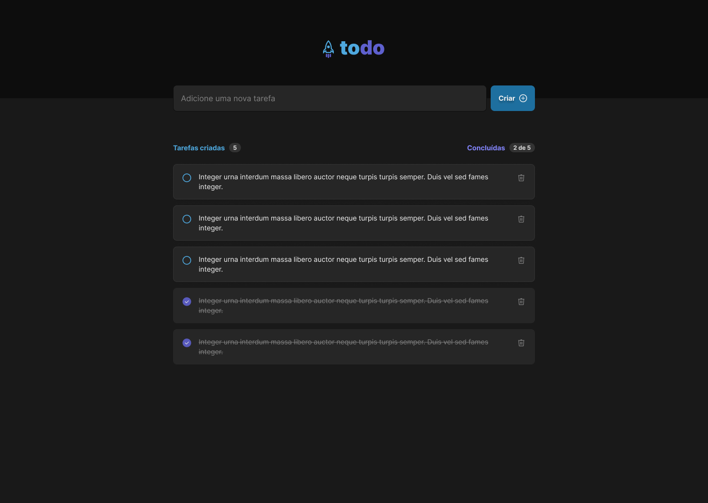

<h1 align="center">TODO</h1>

## Introdução

O TODO é uma aplicação WEB para controle de tarefas, onde o usuário pode inserir uma tarefa, marcar como concluída ou excluí-la da listagem.

É um projeto com o intuíto de aplicar os conceitos básicos aprendidos no módulo 1 do curso Ignite ReactJS da Rocketseat versão 2022.

<div align="center">
  
  
</div>

## Requisitos

- Nodejs
- npm 

## Tecnologias 

- ReactJS
- Vite
- Typescript
- Module CSS
- Phosphor React Icons
- UUID


## Instalação

```sh
# Fazer o clone do projeto em uma máquina local
git clone https://github.com/marciovz/todo-reactjs-ignite2022.git
```

```sh
# Acessa a pasta do projeto
cd todo-reactjs-ignite2022
```

```sh
# Rodar a instalação das dependências do projeto
npm install
```

## Rodando a aplicação

```sh
# Rodar a aplicação localmente
npm run dev
```

Abrir a aplicação no navegador no endereço http://localhost:3000


# Melhorias

- Testes
- Armazenamento dos dados
